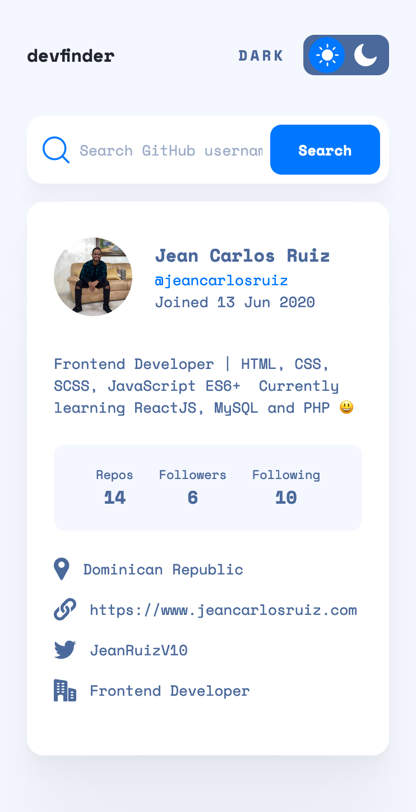
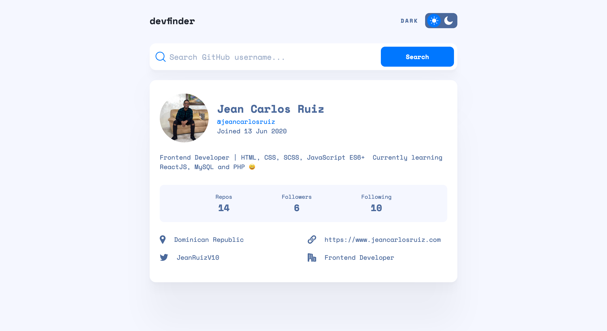

# Frontend Mentor - GitHub user search app

## Table of contents

- [Overview](#overview)
  - [The challenge](#the-challenge)
  - [Screenshot](#screenshot)
  - [Links](#links)
- [My process](#my-process)
  - [Built with](#built-with)
- [Author](#author)

## Overview

### The challenge

Users should be able to:

- View the optimal layout for the app depending on their device's screen size
- See hover states for all interactive elements on the page
- Search for GitHub users by their username
- See relevant user information based on their search
- Switch between light and dark themes

### Screenshot

#### Mobile 📲😯

#### Desktop 🖥️😯

### Links

- Solution URL: [Click Here](https://github.com/jeancarlosruiz/github-user-search-app)
- Live Site URL: [Click Here](https://jeancarlosruiz.github.io/github-user-search-app/)

## My process

### Built with

- Semantic HTML5 markup
- CSS custom properties
- Flexbox
- CSS Grid
- Mobile-first workflow
- Javascript

## Author

- Website - [Jean Carlos Ruiz (Portfolio)](https://www.your-site.com) (Building website)
- Frontend Mentor - [@jeancarlosruiz](https://www.frontendmentor.io/profile/jeancarlosruiz)
